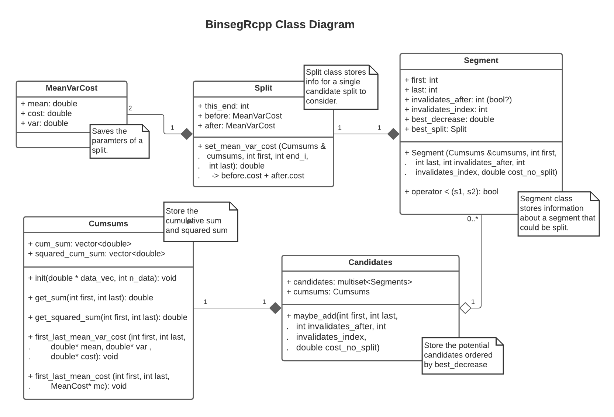

```{r message=FALSE, results = 'hide', warning=FALSE}

packages <- c("neuroblastoma", "ggplot2", "changepoint", "binsegRcpp", "data.table",
              "devtools", "patchwork", "binsegRcpp", "kableExtra")

found <- packages %in% installed.packages()
install.packages(packages[!found], repos='http://cran.us.r-project.org')

for(pack in packages) library(pack, character.only=TRUE)
```
# Test 1: Binary Segmentation using binsegRcpp package.

### Step 1: Filtering and plotting the data

The objective of this test is to generate binary segmentation models up to five segments of the neuroblastoma.profiles
data, for profile.id=4 and chromosome=2. The independent variable is the position in base pairs, while the dependent
variable is the normalized logratio.

First, we need to filter the `neuroblastoma.profiles` dataframe in order to keep only
the data points corresponding to profile.id=4 and chromosome=2. The resulting information is stored as a dataframe
in `nb.profiles`. A plot is generated in order to better visualize the data.

```{r fig.align='center', dpi=250}
data(neuroblastoma) #Load the dataset

#Select the profiles dataframe
nb.profiles = neuroblastoma[['profiles']]

# Logical vector indicating if the particular probe is going to be included
filter <- nb.profiles[['profile.id']] == 4 & nb.profiles[['chromosome']] == 2

#Filter the dataset according to logic vector
nb.profiles <- data.frame(nb.profiles[filter,])

# Generate the plot
plot(nb.profiles[['position']], nb.profiles[['logratio']], type="l", col="blue",
     xlab="Position in base pairs", ylab="Normalized logratio")
grid()
mtext(line=2, cex=1.2, adj=0.5,
      expression(bold("Neuroblastoma: Probe logratio vs Position")))
mtext(line=1, cex=1, adj=0.5, "profile.id = 4, chromosome = 2")
```

### Step 2: Generating the segmentation models with binsegRcpp.

It is evident that there are disruptions in the distribution of the data. In particular, the mean seems to shift at
certain positions (assuming a normal distribution). Therefore, it is ideal to use a changepoint detection algorithm.
They allow to partition a signal into a number of segments, such that the distribution parameters are better fitted to
the measured information. As a result, the signal is then modeled by several distributions, one per segment, instead
of only one (Truong et al, 2020).

There are two main packages which implement the Binary Segmentation algorithm. In this first test, the BinsegRcpp Package
will be used. It allows to generate segmentation models for normally distributed data with changes in mean. It is only
required to specify the data, and the maximum number of segments (in this case 5). After computing the model, the
`coef` method creates a data table containing start, end, and mean for every model from one segment (the whole signal) up
to the specified number of segments. In this case, it computes the parameter for models of 1, 2, 3, 4 and 5 segments.

```{r}
# Generate the changepoint model
models.binsegRcpp <- binseg_normal(nb.profiles[['logratio']], 5)

# Obtaining the table with parameters for models from 1 to 5 segments.
models.binsegRcpp.coef <- coef(models.binsegRcpp)
models.binsegRcpp.coef
```

### Step 3: Creating graphs for models from one to five segments.

Finally, the generated segments will be plotted on top of the neuroblastoma data. The orange horizontal lines are the
mean of each segment, and the blue vertical lines are the changepoints. A facet grid is added so that each segmentation
model appears in a different graph. The number in the right indicates the number of segments in each particular model.


```{r fig.align='center', dpi=250}
# Function to graph a table of segments with start, end, and mean
graph_segments <- function(segments_data, title){
  plot <- ggplot() +
    geom_line(data=nb.profiles, # First graph the line
              mapping=aes(x=position, y=logratio), color="#636363")+
    geom_segment(data=segments_data, #Then make horizontal segments from start to end
                 mapping=aes(x=nb.profiles[['position']][start], y=mean,
                             xend=nb.profiles[['position']][end], yend=mean),
                 color="#fd8d3c", size=0.8) +
    geom_vline(data=segments_data[start > 1], # Add vertical lines for each changepoint
               mapping=aes(xintercept=nb.profiles[['position']][start]),
               color="#56B4E9", size=0.9) +
    facet_grid(segments ~ .) + # Separate into various graphs according to the segments.
    theme_bw() +
    ggtitle(title, subtitle="profile.id = 4, chromosome = 2") +
    labs(x="Position in base pairs", y="Normalized logratio") +
    theme(plot.title=element_text(face="bold",margin=margin(t=10,b=5),size=13),
          plot.subtitle=element_text(margin=margin(t=0,b=5)),
          axis.title.x=element_text(margin=margin(t=8,b=8), size=10),
          axis.title.y=element_text(margin=margin(r=8,l=8), size=10))
  return(plot)
}

# Calling the function with the binsegRcpp model.
graph_segments(models.binsegRcpp.coef, "Neuroblastoma segmentation models with binsegRcpp")
```
Something interesting is the order in which the segments are created. This is because in each iteration of the binary
segmentation algorithm, the segmentation which produces the best decrease in the overall cost of the model is selected.
The negative log-likelihood is usually selected as the cost function.


# Test 2: Binary Segmentation using changepoint package.

### Step 1: Computing the segmentation models with changepoint

In order to create segmentation models with thee changepoint package, the first thing to do is call the `cpt.mean` function.
It has more parameters than `binseg_normal` from binsegRcpp. The reason is that this package is more flexible, and the
usR is able to choose from several changepoint detection algorithms, penalty functions, and statistical distributions.

In order to graph the data, it is convenient to create a data table similar to the one generated with the `coef` method
in binsegRcpp. In this case this requires more work, since the `cpt.range` object from the output only contains the means
for the selected model (the one with five segments).

```{r message=FALSE, warning=FALSE}
# Using changpoint package to compute the model
models.changepoint <- cpt.mean(data=nb.profiles[['logratio']], penalty="None",
                               pen.value=0, method="BinSeg", Q=4, test.stat="Normal",
                               class=TRUE, param.estimates=TRUE)

# Creating the coef data table
models.changepoint.coef <- data.table(segments=integer(0), start=integer(0),
                                      end=integer(0), mean=double(0))

# For each model, compute and organize the mean, start and end of each segment.
for (i in 1:4){
  start <- sort(na.omit(c(1, cpts.full(models.changepoint)[i, ]+1)))
  end <- sort(na.omit(c(cpts.full(models.changepoint)[i, ],
                   length(data.set(models.changepoint)))))

  for(j in 1:(i+1)){
    tmp.mean <- mean(nb.profiles[['logratio']][start[j]:end[j]])
    # Add to the coef data table
    models.changepoint.coef <- rbind(models.changepoint.coef,
                                     list(i+1 , start[j], end[j], tmp.mean))
  }
}

# Setting the names
names(models.changepoint.coef) <- c("segments", "start", "end", "mean")
```

### Step 2: Creating graphs for models from two to five segments.

As the segments data was already organized in the data table, in order to create the graphs it is just necessary to
call the previously defined function `graph_segments`. The generated graph is pretty similar to the previous one, with the
exception that `cpt.mean` doesn't create the model of only one segment.


```{r fig.align='center', dpi=250}
graph_segments(models.changepoint.coef, "Neuroblastoma segmentation models with changepoint")
```

### Step 3: Comparison of binsegRcpp and changepoint models.

The following ggplot shows the changepoints computed by binsegRcpp and changepoint packages. Both of them produce
exactly the same changepoints for this dataset (with a five segments model). In order to visualize them properly, one of the
lines is thicker. The only difference is that the binsegRcpp package includes the last data index as a changepoint, since
it considers the trivial one segment model. A function was created to produce the graph, since the same process will be
repeated later.

```{r fig.align='center', dpi=250}
binseg.cpts = data.frame(changepoint=c(1:5), index=sort(models.binsegRcpp[['end']]))
changepoint.cpts = data.frame(changepoint=c(1:4), index=cpts((models.changepoint)))

comparative_graph <- function(data1, data2, x1, y1, x2, y2, name, xlabel, ylabel, xdisp, ydisp){
  plot <- ggplot() +
    geom_line(data=data1,
              mapping=aes(x=.data[[x1]], y=.data[[y1]], color="binsegRcpp"), size=2) +
    geom_text(data=data1,
              aes(x=.data[[x1]]+xdisp, y=.data[[y1]]+ydisp,label=round(.data[[y1]], 2)),vjust=0) +
    geom_line(data=data2,
              mapping=aes(x=.data[[x2]], y=.data[[y2]], color="changepoint"), size=1) +
    geom_text(data=data2,
              aes(x=.data[[x2]]+xdisp, y=.data[[y2]]+ydisp,label=round(.data[[y2]], 2)),vjust=0) +
    ggtitle(label=name) +
    labs(x=xlabel, y =ylabel, colour="Package")+
    theme_bw() +
    theme(plot.title=element_text(face="bold",margin=margin(t=10,b=15),size=16),
          axis.title.x=element_text(margin=margin(t=10,b=10), size=14),
          axis.title.y=element_text(margin=margin(r=10,l=15), size=14))
  return(plot)
}

comparative_graph(binseg.cpts, changepoint.cpts, 'changepoint', 'index',
                  'changepoint', 'index', "Predicted changepoints per package",
                  "Changepoint number", "Changepoint index", -0.1, 5 )

```

Another ggplot is created in order to compare the loss values. For binsegRcpp, this can be found in the `loss` column
of the output dataframe. For changepoint package, the equivalent values can be obtained with `pen.value.full`. However,
when these values are plotted, it is evident that they greatly differ.

```{r fig.align='center', dpi=250}

changepoint.loss = data.frame(changepoint=2:5, loss=pen.value.full(models.changepoint))

comparative_graph(models.binsegRcpp, changepoint.loss, 'segments', 'loss',
                  'changepoint', 'loss', "Loss value per segment",
                  "Segment number", "Loss Value", 0, 0.5)
```

Both packages use the log-likelihood, which in this case is the squared loss function
$$ c(segment) = \sum_{i = start}^{end} (y_i - \mu_{segment})^2$$
to calculate the cost of a segment given a signal $y$, and segment $start$ and $end$ values with a particular mean $\mu_{segment}$.

This function is used to determine the next changepoint in an iteration of the Binary Segmentation algorithm. When a segment
is created, there is a decrease in the cost of the model, since the sum of the cost of the two newly created segments
will be smaller than the cost of the previous segment. Therefore, the goal is to find the changepoint which produces
the best decrease in the loss value.

The changepoint package returns the best cost decrease of each iteration in the `pen.value.full` vector. However, the overall
cost of a model is calculated by adding the cost of each individual segment. In order to obtain this computation with
this package, it is necessary to use the `logLik` function, although only the cost of the five segments model is obtained.

The binsegRcpp package manages to produce the overall cost of the model without the use of other functions, since it
considers the one-segment model at the beginning of the algorithm. If the cost of the whole signal is known (without segmentation),
then in each iteration the cost of the current model can be obtained by substracting the best decrease. This is equivalent
to substracting the cost of the whole segment, and adding the costs of the two newly created segments.


# Test 3: Negative Binomial Cost Function

### Step 1: Obtain the mathematical expression for the cost function.

According to the [article](https://en.wikipedia.org/wiki/Negative_binomial_distribution#Maximum_likelihood_estimation),
the negative binomial distribution models the probability of finding $k$ successes before $r$ failures on a series of
Bernoulli experiments with a success probability of $p$. In many changepoint detection algorithms, the cost function for
a distribution is the equal to the log likelihood (Killick and Eckley, 2020). For the negative binomial distribution,
the likelihood of parameters $r$ and $p$ given $k$ successes is

$$L(r, p \mid k) = \binom{k + r -1}{r-1}(1-p)^kp^r$$

Then, for a signal $y$ of length $t$, the likelihood of parameters $r$ and $p$ given the whole signal $y_{0}^t$ is equal
to the product of the likelihoods for each individual observation $y_i$

$$L(r, p \mid y) = \prod_{i=0}^t \binom{y_i + r -1}{r-1}(1-p)^{y_i}p^r$$

When the natural logarithm is applied to this equation, it becomes the log likelihood.

$$\ln L(r, p \mid y) = \sum_{i=0}^t \ln \left( \binom{y_i + r -1}{r-1}(1-p)^{y_i}p^r \right)$$

The binomial factor can be expressed in terms of the gamma function

$$\ln L(r, p \mid y) = \sum_{i=0}^t \ln \left( \frac{\Gamma \left( y_i + r \right)}{ \Gamma \left( r \right) \Gamma \left( y_i + 1 \right)}(1-p)^{y_i}p^r \right)$$

Then, by applying the laws of logarithms,

$$ \ln L(r, p \mid y) = \sum_{i=0}^t ( \ln \Gamma ( y_i + r ) - \ln \Gamma ( r ) - \ln \Gamma ( y_i + 1) + y_i \ln (1-p) + r \ln p ) $$

Simplifying the sigma notation,

$$ \ln L(r, p \mid y) = \sum_{i=0}^t ( \ln \Gamma ( y_i + r ) - \ln \Gamma ( y_i + 1)) + (t+1)( r \ln p - \ln \Gamma ( r ))  +  \ln (1-p)  \sum_{i=0}^t y_i $$

This expression represents the cost of a segment $y_k$, if $y$ has a negative binomial distribution. However, the values of
parameters $r$ and  $p$ are unknown when computing a changepoint model. Therefore, they must be estimated for each considered
segment. These values can be parameterized in terms of the mean and the variance of the data, according to the following
equations (Lindén and Mäntyniemi, 2011):

$$ r = \frac{\mu^2}{\sigma^2 - \mu} $$

$$ p = \frac{\mu}{\sigma^2} $$


### Step 2: Implement the function in C

The following C function implements the cost function, by using the same arguments as the other cost functions in the
changepoint package. The function `lgamma()` is used to obtain the logarithm of the factorials.

```{c eval = FALSE}

void negbin_loss(double *SS, int *size, int *n, int *p, int *minorder,
                int *optimalorder, int *maxorder, int *start, int *end, double *cost,
                double *tol, int *error, double *shape, int *MBIC){
    double l = *end - *start; // Length of segment
    double sum = SS[*end] - SS[*start]; // Sum of segment data points.
    double sum_squared = SS[*n + *end] - SS[*n + *start]; // Sum of squared data points.
    double mean = sum/l;
    double var = (sum_squared - sum*sum/l)/l;
    double ps = mean/var; // Probability of success (parameterized).
    double r = fabs(mean*mean/(var-mean)); // Number of allowed failures (parameterized).
    *cost = sum*log(1-ps) + l*(r*log(ps) - lgamma(r)); // Calculated in constant time
    // Adding the log factorials (constant time) for the first element
    for(int i = *start; i <= *end; i++){
        // Adding the log factorials (constant time) for each element
        *cost += lgamma(SS[i] - SS[i-1] + r) - lgamma(SS[i] - SS[i-1] + 1);
    }
}

```

### Side note

Even tough this function is based on the obtained equation, and is mathematically correct, it did not produce the expected
results when I tested it using the changepoint package with data generated by the gfpop package. After analyzing the issue,
I found that assigning the cost as `*cost = sum*log(1-ps) + l*r*log(ps)` and omitting the `for` loop yields pretty accurate results.


# Test 4: Change in mean and variance with binsegRcpp

### Step 1: Find the cost function

The cost function is the log likelihood of the signal or segment $y$ of length $N$ given a mean $\mu$ and a variance $\sigma^2$.
Considering a normal distribution, this can be expressed as

\begin{align*}

\ln L (\sigma ^2 , \mu \mid y) &= \sum_{i = 0}^{t} \ln \left( \frac{1}{\sigma \sqrt{2 \pi}} {\rm e}^{ - \frac{1}{2} (\frac{y_i - \mu}{\sigma})^2} \right) \\

&= \sum_{i = 0}^{t} \left( - \frac{1}{2}\ln \sigma^2 - \frac{1}{2} \ln (2 \pi) - \frac{1}{2} \frac{(y_i - \mu)^2}{\sigma^2} \right)  \\

&= - \frac{1}{2}\ln \sigma^2 \sum_{i = 0}^{t} 1  \: \: - \frac{1}{2} \ln (2 \pi)  \sum_{i = 0}^{t} 1 \: \: - \frac{1}{2 \sigma^2} \sum_{i = 0}^{t} (y_i - \mu)^2  \\

&= - \frac{1}{2} N \ln \sigma^2  \: \: - \frac{1}{2} N \ln (2 \pi)   \: \: - \frac{1}{2 \sigma^2} (\sigma^2 \cdot N)  \\

&= - \frac{1}{2} N \left ( \ln \sigma^2  \: \: + \ln (2 \pi)   \: \: + 1 \right)

\end{align*}

This equation is pretty similar to the cost function implemented in the changepoint package, the only difference being that
the one in changepoint does not take into account the $-\frac{1}{2}$ factor


### Step 2: Understand the code structure and make the changes

In order to make the modifications to the binsegRcpp package, it is necessary to first completely understand its structure.
After creating a class diagram, it was evident that in order to calculate the change in mean and variance only small changes
were required. The following diagram shows the structure including the changes



The implementation of the changes is in my [fork](https://github.com/diego-urgell/binsegRcppMeanVar) of the binsegRcpp package.
(I changed the name to binsegRcppMeanVar to avoid conflicts of versions). The files have comments which explain the modifications.


### Step 3: Test the modified package

In order to verify that the modifications produce accurate results, the binsegRcppMeanVar package can bee tested against
the changepoint package, by using the `cpt.meanvar` function. Models were computed for the same neuroblastoma data, and
both packages indeed produce the same results for segments end, mean and variance. This can be observed in the following
table.

```{r message=FALSE, results = 'asis', warning=FALSE, dpi=250, fig.align='center'}

# Installing and loading the modified version of binsegRcpp

install_github("diego-urgell/binsegRcppMeanVar")
library("binsegRcppMeanVar")

# Computing the model with the modified version of binsegRcpp
models.binsegRcpp.mv <- binsegRcppMeanVar::binseg_normal(nb.profiles[['logratio']], 5)
models.binsegRcpp.mv.coef <- coef(models.binsegRcpp.mv, 5:5)

# Computing the model with the changepeoint package using change in mean and variance
models.changepoint.mv <- cpt.meanvar(data=nb.profiles[['logratio']], penalty="None",
                                     pen.value=0, method="BinSeg", Q=4,
                                     test.stat="Normal", class=TRUE, param.estimates=TRUE)

# Adjusting the data to display the table
changepoints <- data.table(number=1:5,
                           'end(binseg)'=models.binsegRcpp.mv.coef$end,
                           'end(cpts)'=c(cpts(models.changepoint), NA),
                           'mean(binseg)'=models.binsegRcpp.mv.coef$mean,
                           'mean(cpts)'=param.est(models.changepoint.mv)$mean,
                           'var(binseg)'=models.binsegRcpp.mv.coef$var,
                           'var(cpts)'=param.est(models.changepoint.mv)$variance)

kable(changepoints, caption="End of segment, mean and variance computed by packages
      binsegRcppMeanVar (binseg) and changepoint (cpts) per segment number.") %>%
        column_spec(column=c(1, 3, 5, 7), border_right=T) %>%
        kable_styling(position="center")


```
The only difference arises when obtaining the cost of the model. The following table shows the loss for the binsegRcppMeanVar
model and the changepoint one

```{r message=FALSE, results = 'asis', warning=FALSE}
loss <- data.table(binsegRcppMeanVar=models.binsegRcpp.mv$loss[5],
                   changepoint=unlist(logLik(models.changepoint.mv))[1])

kable(loss, caption="Loss for the five segments model produced by each package") %>%
  kable_styling(position="center", full_width=F)
```
The loss produced by binsegRcppMeanVar is exactly half the cost produced by changepoint, since the later does not take
into account the $-1/2$ factor that arises in the cost function.

# References

Killick, R., &amp; Eckley, I. A. (2014). Changepoint: AnRPackage for changepoint analysis. Journal of Statistical Software, 58(3). doi:10.18637/jss.v058.i03

Lindén, A., &amp; Mäntyniemi, S. (2011). Using the negative binomial distribution to model overdispersion in ecological count data. Ecology, 92(7), 1414-1421. doi:10.1890/10-1831.1

Truong, C., Oudre, L., &amp; Vayatis, N. (2020). Selective review of offline change point detection methods. Signal Processing, 167, 107299. doi:10.1016/j.sigpro.2019.107299

Wikipedia. (2021, March 02). Negative binomial distribution. Retrieved March 08, 2021, from https://en.wikipedia.org/wiki/Negative_binomial_distribution#Maximum_likelihood_estimation

